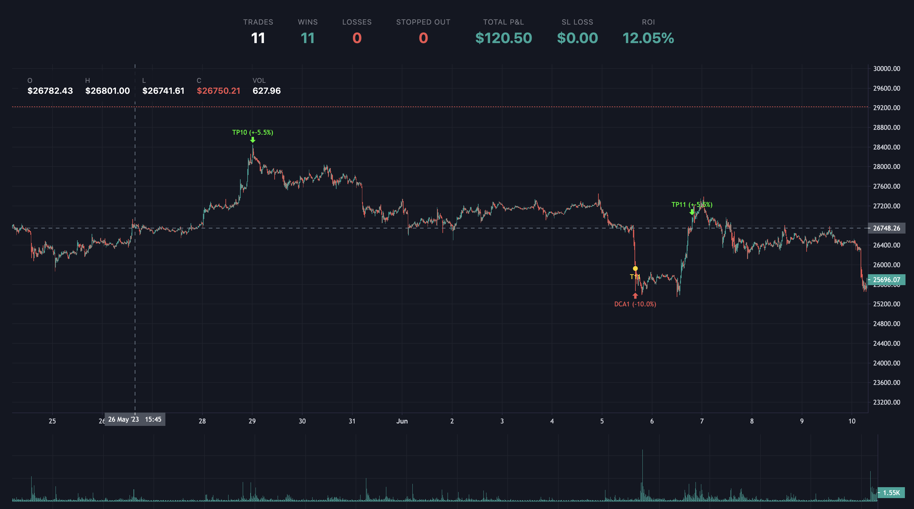
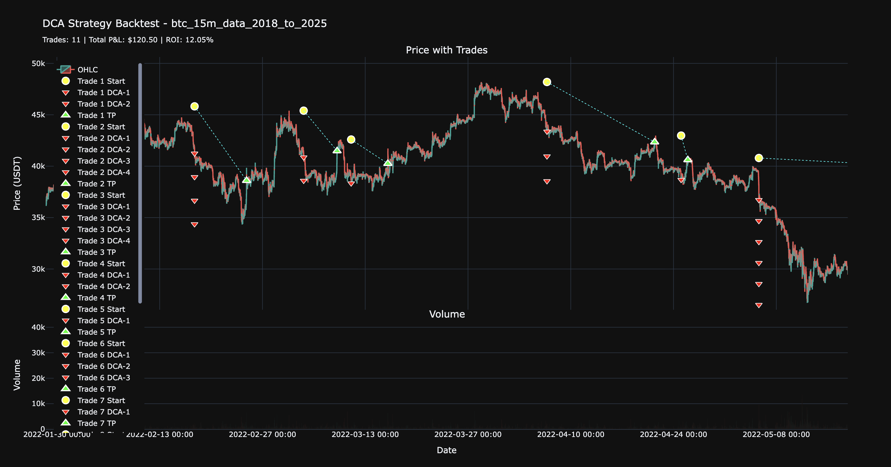
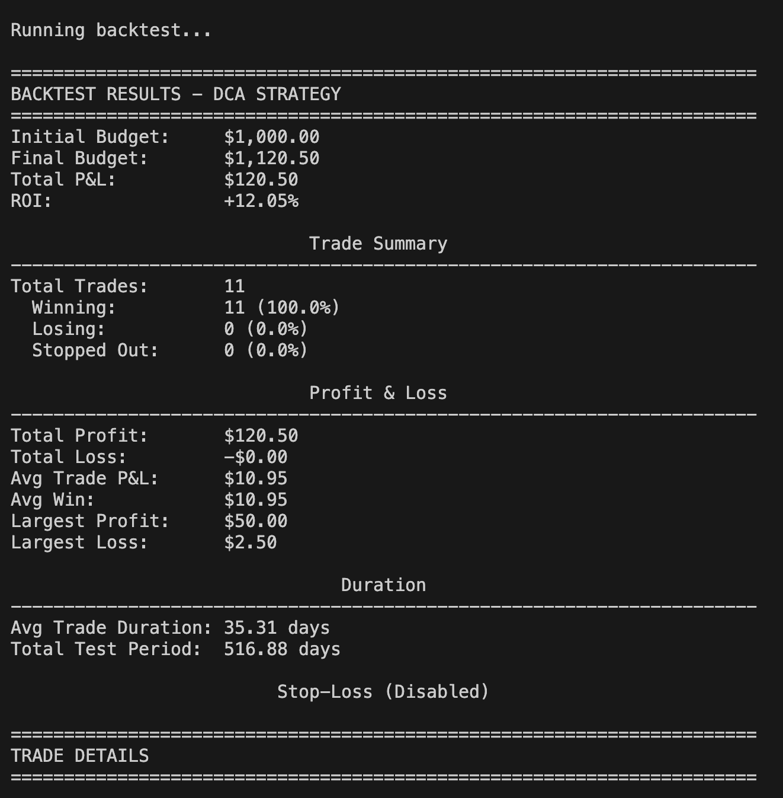
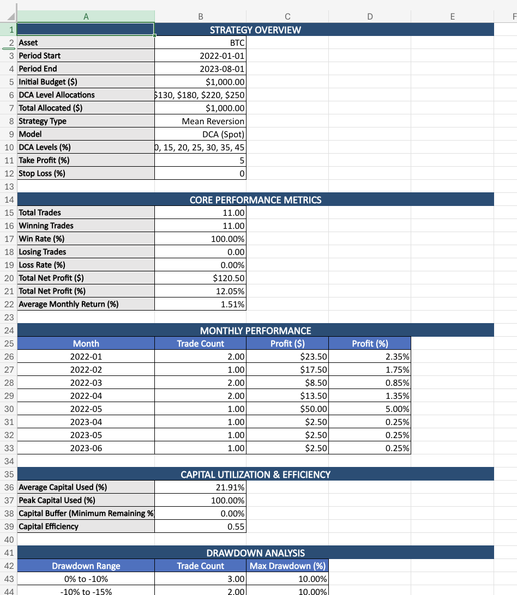

# Algo Trading — DCA Strategy Backtester

A Python backtesting engine for a laddered Dollar-Cost-Averaging (DCA) trading
strategy on historical crypto/asset price data. Configure a ladder of buy-the-dip
levels and a portfolio-level take-profit target, run it against years of
historical candles, and get back trade-by-trade results, an interactive chart,
and an investor-style Excel report.

> ⚠️ This is a research/education tool for backtesting
> a strategy against historical data. Past performance on historical data does
> not predict future results. Use at your own risk.

<table>
  <tr>
    <td></td>
    <td></td>
  </tr>
  <tr>
    <td></td>
    <td></td>
  </tr>
</table>

## Why DCA-with-a-ladder

Instead of a single dip-buy, the strategy places a series of buy orders at
increasing discounts from a reference price, with the allocation per level
configurable (deeper dips can get bigger allocations). Take-profit is
calculated from the __portfolio-level average entry price__ across all filled
levels — not just the price of the last fill — so the exit price reflects the
actual blended cost basis. See [docs/ALGORITHM_SPECIFICATION.md](docs/ALGORITHM_SPECIFICATION.md)
for the full math and worked example.

## Features

- Configurable DCA ladder: any number of levels, custom discount percentages,
   custom USD allocation per level
- Portfolio-level take-profit (not last-entry-price take-profit)
- Optional stop-loss ([docs/STOP_LOSS.md](docs/STOP_LOSS.md))
- Deterministic, wick-based execution (uses candle high/low only)
- Interactive [TradingView Lightweight Charts](https://tradingview.github.io/lightweight-charts/docs)
   view with trade markers
- Matplotlib chart view
- Investor-style Excel report generation
- Config-driven — tune the strategy via a single JSON file, no code changes needed

## Install

```bash
python3 -m venv .venv
source .venv/bin/activate
pip install -r requirements.txt
```

## Configure

Edit [strategy_config.json](strategy_config.json):

```json
{
  "csv_file": "data/btc_15m_data_2018_to_2025.csv",
  "start_date": "2022-01-01",
  "end_date": "2023-08-01",
  "initial_budget": 1000,
  "stop_loss_percent": 0.0,
  "dca_levels": [-10, -15, -20, -25, -30, -35, -45],
  "dca_allocations": [50, 70, 100, 130, 180, 220, 250],
  "take_profit_percent": 5.0
}
```

| Field | Description |
|---|---|
| `csv_file` | Path to OHLC(V) CSV with an `open time` or `timestamp` column |
| `start_date` / `end_date` | Optional date range to filter the backtest |
| `initial_budget` | Starting capital in USD |
| `dca_levels` | Descending, negative dump percentages, e.g. `-10, -15, -20` |
| `dca_allocations` | USD allocated to each level, same length as `dca_levels` |
| `take_profit_percent` | Portfolio-level profit target that closes the position |
| `stop_loss_percent` | `0` disables; see [docs/STOP_LOSS.md](docs/STOP_LOSS.md) |

## Run

```bash
source .venv/bin/activate

# Run the backtest and print results (uses strategy_config.json by default)
python run_backtest.py

# Or point it at a different config file to compare setups side by side
python run_backtest.py my_other_config.json

# Interactive TradingView-style chart with trade markers
python trading-view.py

# Matplotlib chart view
python pyplot-view.py

# Investor-style Excel report → reports/
python generate_excel_report.py
```

## Project layout

```sh
dca_strategy.py          Core strategy + backtest engine
config_loader.py         Loads and validates strategy_config.json
run_backtest.py          CLI: run a backtest from config, print results
trading-view.py          Interactive chart with trade markers
pyplot-view.py           Matplotlib chart view
generate_excel_report.py Excel report generator
data/                    Historical BTC OHLCV CSVs (15m/1h/4h/1d) used as backtest input
docs/                    Algorithm spec and feature docs
scripts/                 Ad-hoc analysis/verification scripts
```

## Known limitations

This is a research tool, not a production trading system:

- No trading fees or slippage modeled yet (see [Roadmap](#roadmap))
- Assumes full fills at the exact limit price on wick touch (no partial fills
   or liquidity constraints)
- No live exchange execution — historical replay only
- Single-asset, single-strategy per run — no portfolio-level backtesting

## Roadmap

- [ ] Trading fees, slippage, and tax modeling in P&L calculations
- [ ] Reinforcement learning-based optimization of strategy configs (DCA
   levels, allocations, TP/SL) instead of manual tuning
- [ ] Walk-forward / out-of-sample validation to reduce overfitting risk
- [ ] Multi-asset / multi-strategy backtesting

## License

[MIT](LICENSE)
